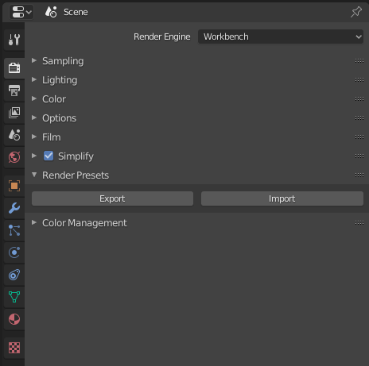
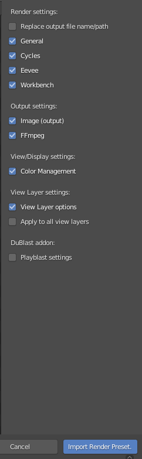

# Introduction

*DuRPresets* is an add-on for *Blender* which exports and imports all render settings as external presets.

[You can download it here](https://rainboxlab.org/tools/durpresets/).

These presets are stored in *JSON* files, which can be edited with any text editor.

It adds a *Render Presets* section in the *Render Properties* panel, with the two buttons to import and export.

When importing a preset, you can select which part of the preset has to be imported (general settings, cycles settings, eevee settings, output settings...)

*DuRPresets* also exports and imports the settings set with [*DuBlast*](https://rainboxlab.org), an add-on for quickly creating and playing playblasts.

## License

### Software

***DuRPresets* Copyright (c) 2019 Nicolas Dufresne**  

*DuRPresets* is free software; you can redistribute it and/or modify it under the terms of the GNU General Public License as published by the Free Software Foundation; either version 3 of the License, or (at your option) any later version.

*DuRPresets* is distributed in the hope that it will be useful, but WITHOUT ANY WARRANTY; without even the implied warranty of MERCHANTABILITY or FITNESS FOR A PARTICULAR PURPOSE.  See the GNU General Public License for more details.

You should have received a copy of the *GNU General Public License* along with *DuRPresets*.  If not, see http://www.gnu.org/licenses/.

  

### Documentation

**Copyright (C)  2019 Nicolas Dufresne**  
Permission is granted to copy, distribute and/or modify this document under the terms of the GNU Free Documentation License, Version 1.3 or any later version published by the Free Software Foundation;  
with no Invariant Sections, no Front-Cover Texts, and no Back-Cover Texts.
A copy of the license is included in the section entitled "[Documentation License](doc-license.md)".

  